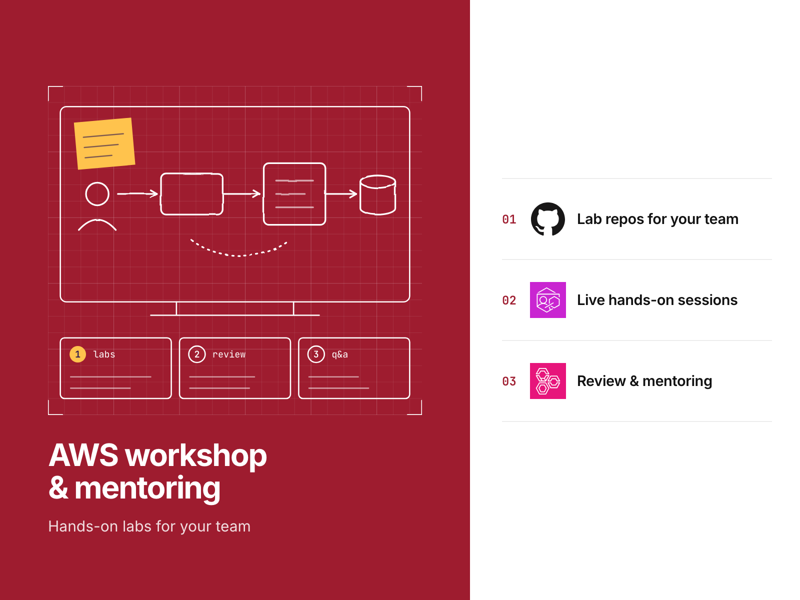
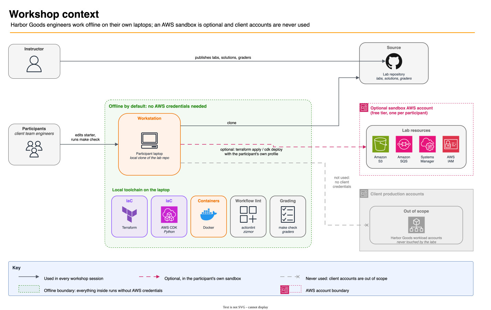

# AWS DevOps workshop labs

These five hands-on labs cover AWS, Terraform, CDK and CI/CD training. Every lab includes a starter, a solution and a
grader that participants can run on a laptop without an AWS account.

[](https://github.com/gamaware/aws-devops-workshop-labs/actions/workflows/ci.yml)
[](LICENSE)




> **Lab.** Harbor Goods and all data here are fictional. Each repository in this portfolio is a separate engagement
> with Harbor Goods, a fictional mid-size retailer. Account IDs are AWS documentation examples.

## What this proves

- **Exercises with work to complete:** participants fix a starter, compare it with a model solution and run a grader in
  each lab. The build verifies that all solutions pass and all untouched starters fail, so CI detects labs broken by
  upgrades before a workshop reaches them.
- **Feedback within the session:** participants run `make check LAB=NN` to see, in plain language, which objective
  remains unfinished while the instructor assists another participant.
- **Practice with production techniques:** labs use mocked `terraform test`, CDK assertions with cdk-nag, actionlint and
  zizmor for workflows, an OIDC trust policy dry run, and a read-only container run without capabilities.
- **Company accounts stay separate:** grading runs entirely offline; optional sandbox steps include cleanup
  instructions.
- **Resources for instructors:** the material includes half-day workshop agendas, individual lab notes, a mentoring
  notes template and instructions for adapting a lab to a client's stack.

## Inspect the deliverable

| Artifact | Why look |
| --- | --- |
| [`labs/04-github-actions-oidc/`](labs/04-github-actions-oidc/README.md) | Stored keys to OIDC, with an offline trust-policy dry run |
| [`labs/01-terraform-remote-state/tests/`](labs/01-terraform-remote-state/tests) | What a hardened state bucket must guarantee, as mocked tests |
| [`labs/03-cdk-python-assertions/tests/test_grader.py`](labs/03-cdk-python-assertions/tests/test_grader.py) | cdk-nag plus template assertions, and a rule against suppressing findings |
| [`scripts/verify-labs.sh`](scripts/verify-labs.sh) | The check that every solution passes and every starter fails |
| [`instructor/`](instructor/README.md) | Instructor guide, half-day agenda, notes per lab |
| [`docs/`](docs/README.md) | How-to guides, reference and explanations (Diátaxis) |

## Scenario and acceptance criteria

Harbor Goods wants to train its platform team. The engineers have Linux and Git experience and some Terraform
experience, but they have not configured remote state, tested infrastructure code or deployed without stored keys.
Their team lead requests a half-day workshop on one two-lab track, followed by mentoring. Participants bring their own
laptops; the workshop excludes the company's AWS accounts.

| Acceptance criterion | How it is met | Checked by |
| --- | --- | --- |
| Every lab can be completed without AWS credentials | Mocked providers, local synth, offline dry run, local Docker | CI grades every lab with no credentials |
| Each solution meets every objective | Graders with one exit-code contract (0, 1, 2) | `make labs` |
| Each untouched starter still needs work | The starter must exit 1 and fail exactly the checks in `tests/starter-failures.txt` | `make labs` |
| Each lab states objectives, prerequisites, duration, steps, expected result and reset | Fixed README sections | `make docs-check` |
| Solutions are secure examples | Checkov, Trivy, Semgrep, hadolint, zizmor on the solutions | `make checkov`, `make trivy`, CI |
| An instructor can run it without the author | Notes per lab, agenda, mentoring template | `make docs-check` (notes exist per lab) |

## Architecture





After cloning the repository, participants complete the work on their laptops, running Terraform, the CDK Python
library, Docker and the linters locally. Each grader identifies the objectives the participant has met. For live steps,
participants can optionally use a sandbox account, with one account per participant. GitHub hosts the labs, solutions
and graders published by the instructor. The client's AWS accounts are unnecessary for every lab.

| Lab | Topic | Duration | AWS services it teaches |
| --- | --- | --- | --- |
| [01](labs/01-terraform-remote-state/README.md) | Terraform fundamentals and the remote-state pattern | 85 min | S3, Systems Manager Parameter Store |
| [02](labs/02-terraform-module-testing/README.md) | A Terraform module and its `terraform test` suite | 85 min | SQS with a dead-letter queue |
| [03](labs/03-cdk-python-assertions/README.md) | AWS CDK in Python with assertions and cdk-nag | 85 min | S3 with access logs |
| [04](labs/04-github-actions-oidc/README.md) | GitHub Actions to AWS with OIDC, checked offline | 80 min | IAM OIDC provider, STS, S3 |
| [05](labs/05-containers-to-ecs/README.md) | From a Dockerfile to an ECS task definition | 90 min | ECR, ECS on Fargate, Secrets Manager, CloudWatch Logs |

Durations include a 10-minute brief and demo and a 15-minute debrief, as in the
[half-day agendas](instructor/agenda-half-day.md). Consult the [lab path diagram](docs/diagrams/02-lab-path.svg)
for what each lab builds and the [OIDC flow](docs/diagrams/03-oidc-flow.svg) for lab 04.
Each export has its `.drawio` source alongside it.

## Verify locally

Prerequisites: uv, Terraform, Node.js, Docker with the daemon running, hadolint, tflint, Checkov (run through uv) and
Trivy. The [tooling reference](docs/reference/tooling.md) lists the versions CI uses.

```bash
make verify
```

Running the checks requires no AWS credentials and sends no requests to AWS APIs. On the initial run, downloads include
Python packages, Terraform providers, the Python base image and the Trivy database. Subsequent lab grading finishes in
less than a minute and outputs a separate line for each lab:

```text
lab                              solution   starter    verdict
01-terraform-remote-state        exit 0     exit 1     ok
...
verify-labs: 5 lab(s) ok (solutions pass, starters fail with the expected findings)
verify: all checks passed
```

To assess their work, participants run `make check LAB=01`; to begin again, they run `make reset LAB=01`. The complete
target list appears in `make help`, with explanations in [make targets](docs/reference/make-targets.md).

The manual `make test-live` command targets the maintainer's own account. It applies the Terraform solutions for labs 01
and 02 in a real account, checks the results and destroys everything afterward. Instructions appear in
[run the live test](docs/how-to/run-the-live-test.md).

## Repository map

```text
labs/
  NN-topic/
    README.md           tutorial: objectives, prerequisites, duration, scenario, steps, expected result, reset
    starter/            what participants edit
    solution/           model answer
    tests/run.sh        grader (exit 0 met, 1 not met, 2 broken)
    tests/starter-failures.txt  the failures the untouched starter must report
fixtures/oidc-claims/   sample GitHub OIDC token claims for the lab 04 dry run
instructor/             instructor guide, half-day agenda, notes per lab, mentoring notes template
docs/
  how-to/               set up a machine, use a sandbox account, run the live test, add a lab
  reference/            grader contract, make targets, tooling
  explanation/          remote state, what offline tests prove, OIDC federation, containers on Fargate
  adr/                  architecture decision records
  diagrams/             .drawio sources with SVG and PNG exports
scripts/                verify-labs.sh, lib/grader.sh, check_docs.py, reset-lab.sh, test-live.sh
Makefile                one entry point for local and CI runs
```

## Decisions and trade-offs

Architecture decision records follow the *Fundamentals of Software Architecture* (2nd ed.) format.

| Number | Title | Status |
| --- | --- | --- |
| [0001](docs/adr/0001-starter-solution-grader-per-lab.md) | Every lab ships a starter, a solution and a grader, and the build proves the starter needs work | Accepted |
| [0002](docs/adr/0002-offline-first-labs.md) | Labs run offline by default; a sandbox account is optional | Accepted |
| [0003](docs/adr/0003-starters-graded-not-scanned.md) | Graders check the starters; scanners skip them | Accepted |
| [0004](docs/adr/0004-one-locked-python-environment.md) | One locked Python environment for the CDK lab and the graders | Accepted |

## Security and quality gates

| Gate | Runs in | Why |
| --- | --- | --- |
| Lab grading (solutions pass, starters fail) | `make labs`, CI `verify` job | Labs stay working and stay exercises |
| Docs check | `make docs-check`, CI `verify` job | Required lab sections, instructor notes, working relative links |
| ruff, shellcheck, shellharden, terraform fmt, tflint | `make lint`, `make tflint`, CI `verify` job, pre-commit, shared `terraform` workflow | Consistent, correct code |
| Checkov, Trivy, Semgrep | `make checkov`, `make trivy`, CI `verify` job, shared `security` workflow | Policy and misconfiguration checks on the solutions; skips carry reasons in the code |
| hadolint, image build and Trivy image scan | pre-commit, shared `container` workflow | The lab 05 solution image |
| actionlint, zizmor | pre-commit, shared `lint-actions` workflow, lab 04 grader | Workflow correctness and hardening |
| gitleaks, detect-secrets | pre-commit, shared `secrets` workflow | No credentials in the history |
| markdownlint, Vale, lychee | pre-commit, shared `lint-docs` workflow | Readable docs and working links |
| OpenSSF Scorecard | `scorecard.yml` | Repository supply-chain posture |

The CI `verify` job runs `make verify`, the same command as a local run. Through reusable workflows pinned to a
commit SHA, `ci.yml` also invokes the shared checks from
[gamaware/.github](https://github.com/gamaware/.github). Each workflow begins with `permissions: {}`, uses SHA-pinned
actions and defines timeouts. All jobs run without cloud credentials.

## Limits and production adaptations

- **Simulation coverage:** graders verify configuration intent using mocked providers, synthesized templates and local
  containers. IAM permissions, service quotas, an actual OIDC token exchange and an ECS deployment remain unproven.
  Participants can find these limits explained in
  [What offline tests prove](docs/explanation/what-offline-tests-prove.md).
- **Outside the scope:** the labs exclude a CDK deployment, an actual GitHub-to-AWS OIDC run and an ECS service. The
  sandbox how-to presents these as optional steps; the
  [ECS Fargate lab](https://github.com/gamaware/aws-ecs-fargate-deploy-lab) covers building the full service.
- **Engagement additions:** a real engagement includes rebuilding labs around the client's repositories and stack in the
  Advanced format, English or Spanish sessions, recordings and written notes following every mentoring session.
- **Running costs:** offline work costs nothing. Optional sandbox steps exist for labs 01 to 04 and cost a few cents
  per lab if participants follow each lab's Reset section. Lab 05 has no live step: Fargate has no free tier, so the
  lab stays on local Docker.

## Related work

This repository belongs to the [AWS DevOps portfolio](https://github.com/gamaware/aws-devops-portfolio) and backs the
"AWS workshop and mentoring" service:
[AWS workshop and mentoring on Upwork](https://www.upwork.com/freelancers/~014b3520cf9e140103).

## License

The license is [MIT](LICENSE). [gamaware/.github](https://github.com/gamaware/.github) supplies the contribution,
support and security policies; reporting instructions appear in [SECURITY.md](SECURITY.md).
