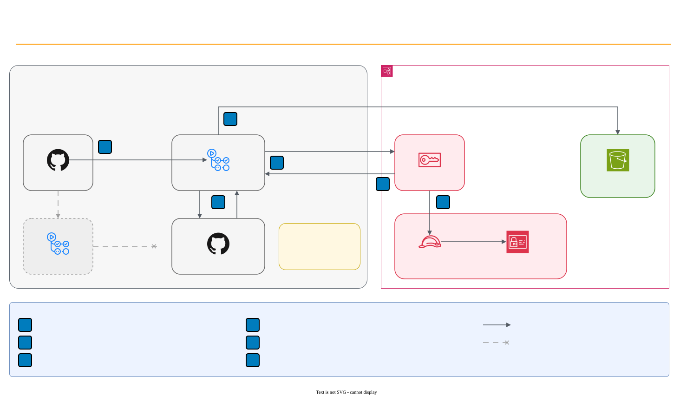

# GitHub OIDC federation to AWS

Lab 04 deploys the Harbor Goods storefront from GitHub Actions to S3 without an AWS access key stored anywhere.
This page explains the exchange that makes that possible and the choices in the lab's trust policy.



## The exchange

1. The deploy job asks GitHub's OIDC provider, `token.actions.githubusercontent.com`, for a token. GitHub signs a
   JSON Web Token that describes the run.
2. `aws-actions/configure-aws-credentials` sends the token to AWS STS in an `AssumeRoleWithWebIdentity` call for
   the role `harbor-storefront-deploy`.
3. STS checks the signature against the IAM OIDC identity provider registered in the account, then evaluates the
   role's trust policy against the token's claims.
4. If the trust policy allows it, STS returns credentials that expire, by default after one hour. The job
   runs `aws s3 sync`; the role's permission policy limits it to the site bucket.

No secret crosses the boundary. A leaked token is useless after a few minutes and only for the role it names, and
nothing needs rotating.

## The claims that matter

| Claim | Example | Checked by |
| --- | --- | --- |
| `iss` | `https://token.actions.githubusercontent.com` | STS, through the registered OIDC provider |
| `aud` | `sts.amazonaws.com` | The trust policy, `token.actions.githubusercontent.com:aud` |
| `sub` | `repo:harbor-goods/storefront:environment:production` | The trust policy, `token.actions.githubusercontent.com:sub` |

The `sub` claim changes shape with the trigger:

| Run | `sub` |
| --- | --- |
| Job with an environment | `repo:OWNER/REPO:environment:NAME` |
| Pull request | `repo:OWNER/REPO:pull_request` |
| Push, no environment | `repo:OWNER/REPO:ref:refs/heads/BRANCH` |

When a job declares `environment:`, the environment replaces the branch in `sub`. The lab uses that: the deploy
job runs in `production`, and only a job in that environment can match the trust policy. GitHub environment
protection rules, such as required reviewers or a `main`-only branch rule, then gate every token the role
accepts.

## StringEquals, not StringLike

The lab's starter trusts `repo:harbor-goods/*` with `StringLike`. That admits every repository in the
organization, every branch, every pull request and every environment. The solution names the one subject it
expects, with `StringEquals`, and checks the audience too:

```json
"StringEquals": {
  "token.actions.githubusercontent.com:aud": "sts.amazonaws.com",
  "token.actions.githubusercontent.com:sub": "repo:harbor-goods/storefront:environment:production"
}
```

Use `StringLike` only when the set of valid subjects is a pattern you mean, and keep the wildcard as far right
as possible. A trust policy without any `sub` condition lets any GitHub repository in the world assume the role.

The dry run in `tests/oidc_dry_run.py` evaluates the policy against the claim files in `fixtures/oidc-claims/`:
only `push-main-production` may pass; the pull request, feature branch, other repository, staging environment and
wrong audience cases must fail.

## Why only the deploy job gets `id-token`

A job can request an OIDC token only with `permissions: id-token: write`. The lab workflow sets `permissions: {}`
at the top and grants `id-token: write` to the `deploy` job alone. The `validate` job, which runs on every pull
request, cannot mint a token, so code under review never gets near AWS, even if a test script or a compromised
action misbehaves.

## Pull requests and forks

The deploy job has `if: github.event_name == 'push' && github.ref == 'refs/heads/main'`, so pull requests never
reach it. This is the first layer. The trust policy is the second: even a workflow edited in a pull request to
request a token would present `repo:harbor-goods/storefront:pull_request` as its subject, which the policy
rejects.

GitHub does not grant `id-token: write` to workflows triggered by `pull_request` from forks. Avoid the
`pull_request_target` trigger for anything that checks out pull request code: it runs with the base repository's
permissions.

See [lab 04](../../labs/04-github-actions-oidc/README.md) to build the workflow and the policies.
